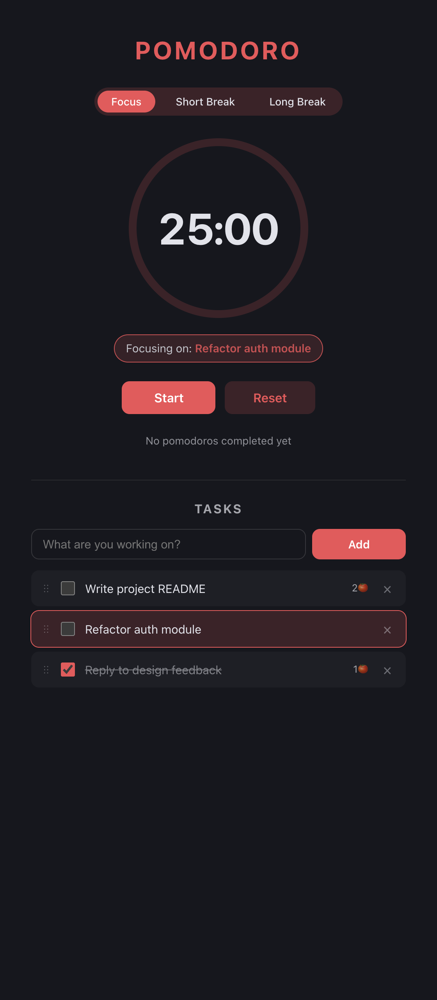

# Pomodoro

A focused, no-fuss Pomodoro timer with task tracking. Built with React, TypeScript, and Vite.

<p align="center">
  
</p>

## Features

- **Three timer modes** — 25-min Focus, 5-min Short Break, 15-min Long Break — each with its own accent color
- **Animated SVG ring** that drains as time counts down
- **Audio chime** (Web Audio API) when a session completes
- **Live document title** so you can track the timer from another tab
- **Task list** with add / complete / delete, persisted to `localStorage`
- **Active task** — click a task to focus on it; completed pomodoros increment its 🍅 count
- **Drag to reorder** tasks via native HTML5 drag-and-drop
- **Dark mode** based on system preference

## Getting Started

```bash
npm install
npm run dev
```

Open the printed URL (defaults to `http://localhost:5173/`).

### Other scripts

```bash
npm run build                 # type-check and produce a production build in dist/
npm run preview               # serve the production build locally
node scripts/screenshot.mjs   # regenerate docs/screenshot.png (dev server must be running)
```

## Project Structure

```
src/
├── App.tsx                 # composes the pieces; owns top-level state
├── App.css                 # component styles
├── index.css               # base styles, reset, dark-mode tokens
├── types.ts                # Mode, Task
├── constants.ts            # DURATIONS, LABELS, MODES
├── hooks/
│   ├── useTimer.ts         # timer state machine + tick loop
│   └── useTasks.ts         # CRUD + reorder + localStorage persistence
├── components/
│   ├── ModeTabs.tsx        # Focus / Short / Long switcher
│   ├── TimerRing.tsx       # SVG progress ring + display
│   ├── Controls.tsx        # Start / Pause / Resume / Reset
│   └── TaskList.tsx        # add form, list, drag-and-drop
└── utils/
    ├── time.ts             # formatTime
    └── sound.ts            # Web Audio beep
```

Each piece has a single responsibility, so swapping the timer source, the storage backend, or the UI of any panel is a one-file change.

## Tech

- [React 19](https://react.dev/) + [TypeScript](https://www.typescriptlang.org/)
- [Vite](https://vitejs.dev/) for dev server and builds
- No runtime dependencies beyond React itself
